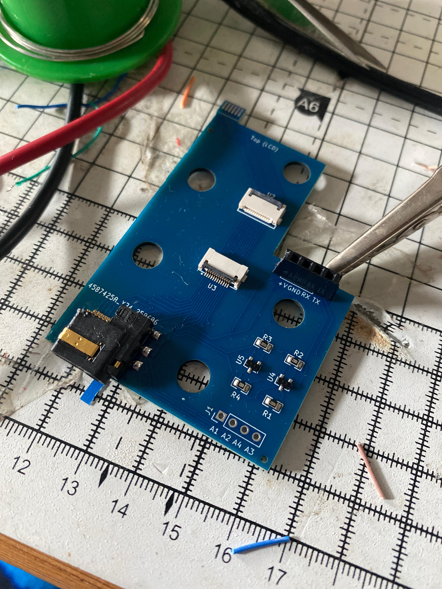
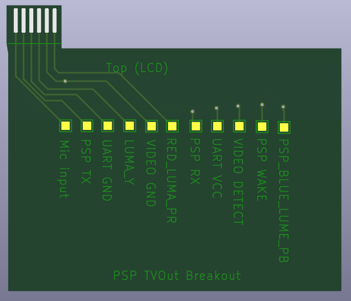
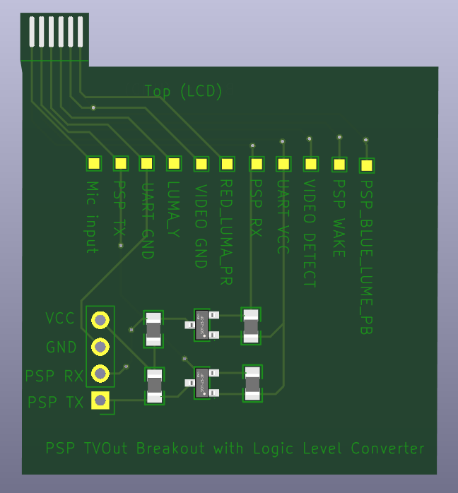

  

<h1 align="center"> AV Breakout </h1>

  <b >An AV-Out Breakout library for the PSP. Providing Kicad symbols and footprints to interface with the PSP 2/3K Av out socket (also known as the TVOut socket)</b>

---

**TOC**
* [How to install](#how-to-install-the-library) 
* [Samples](#samples)
  * [Pass-Through (Tested)](#pass-through-tested)
  * [AV-Connector-Breakout (NOT Tested)](#av-connector-breakout-not-tested)
  * [AV-Connector-Breakout-LLC (NOT Tested)](#av-connector-breakout-llc-not-tested)
* [Damage to the PSP](#damage-to-the-psp)
* [Gotchas](#gotchas)
* [Connector pinout](#connector-pinout)

---

⚠ **This has not been *fully* tested yet. When my prototypes arrive i will update this repo** ⚠

---

This project contains two components that can be used within your own PCB designs for interfacing with the PSP. All components have full pinouts and pin descriptions.

## TVOut Cable

This is the AV Connector found on a AV cable which plugs into the PSP.

## TVOut Connector

This is the socket which the AV Cable plugs into. It is soldered to the PSP motherboard.

---

Whilst the intent is for other people to use these components there are some sample projects which can be used directly or as reference.

# How to install the library

Download the latest release. Inside the `library` folder you will find a `psp.pretty` folder and a `psp.kicad_sym` file. These are the `footprints` and `symbols` respectively.

To install;

**Symbols**
* Open the Kicad project (not the schematic/pcb editor)
* Click `Preferences` -> `Manage Symbol Libraries`
* Choose if you want to install the library globally or project specific
* Click the `+` icon to add a new row.
* Give it the knickname `psp`
* Select the `psp.kicak_sym` file from wherever you saved it

**Footprints**
* Open the Kicad project (not the schematic/pcb editor)
* Click `Preferences` -> `Manage Footprint Libraries`
* Choose if you want to install the library globally or project specific
* Click the `+` icon to add a new row.
* Give it the knickname `psp`
* Select the `psp.pretty` folder from wherever you saved it

# Samples

There are a number of samples in the project. If you wish to load them in Kicad clone the repository and open the project.

If you just wish to have them produced, download the latest release and you will find them inside the `samples` folder. I have mine produced by `JLCPcb` so my BOM files are built for them.

## Pass-Through (Tested)

This sample is a complete example. It has a AC Cable to connect to the PSP, a AV Connector to use an original AV cable. All the video signals are forwarded. It also has a Logic Level converter for the serial lines.

This sample will allow you access to the PSP's serial port and use a AV cable at the same time.

This sample requires parts assembly so conains extra files needed for them.

## AV-Connector-Breakout (NOT Tested)

This is a simple breakout of every pin in the AV port on the PSP. It has no other parts so will require no assembly. Each pin is described.

## AV-Connector-Breakout-LLC (NOT Tested)

This is the same as `AV-Connector-Breakout` except it includes a Logic Level Converter for the serial lines. This will require parts assembly.

# Damage to the PSP

You should bevel, slightly curve, all the edges of the `TV out connector` that plugs into the PSP. So the edges are not all perfect 90deg angles. Otherwise it could damage the contacts. This will need to be manually done.

# Gotchas

* For the PSP to detect an AV cable connected it needs the heaphones cable connected. If your using the `Pass-Through` sample or degining your own PCB to use video output you will need to connect a headphones cable otherwise the PSP will not output video.
* Use of the serial port does *not* need a headphones cable connected unlike video output.
* The PSP's serial port does not operate at `5v` or `3.3v` like most MCU's you will try to interface with (Arduino, ESP32 etc). You will need to use a `Logic Level Converter`, some of the samples have one built in.
* The TV Connector would need to be manually soldered, they are difficult and require hot air. I source mine from `ZedLabz` https://www.zedlabz.com/products/headphone-socket-for-sony-psp-2000-3-5mm-jack-port-repair-part-internal-replacement-zedlabz

# Connector pinout

Openng a sample in Kicad and looking at either of the components will reveal the connector pinout. However you can reference https://www.psdevwiki.com/psp/Serial_Adapter also.