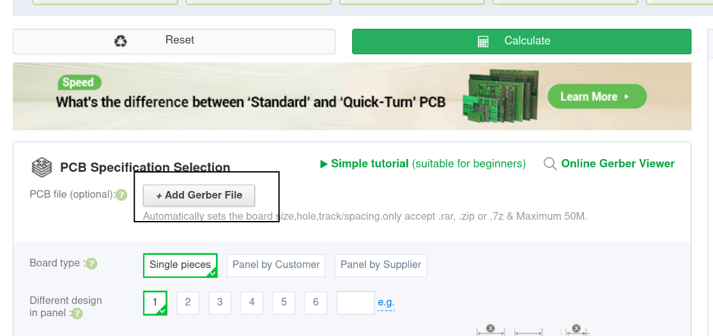

# Having boards produed by PCBWay

My preferred method for having boards manfuactured is via [PCBWay](https://pcbway.com).

The first job is to download a [Release]().

Once downloaded pick a sample, there are currently two;

* AV-Breakout - Very simple board that breaks out every pin on the PSP's AV socket.
* Dev Board - A development board, forwards on all pins to a AVConnector footprint to use original AV cables. Also routes to serial lines to an ESP32 and includes logic level shifters.

Inside both folders there wil be a `Gerbers.zip` which contains all the data to build the PCB itself.

The `Dev Board` will also have a `BOM` an `Positions` file. These tell PCBWay which components they should assemble and where on the PCB they sould be placed.

## Steps

* Click `Quote Now`

* Click `Upload Gerber Files`

* Click `Add Gerber Files` and select the `Gerers.zip` for the board you wish to make.

* Scroll down and ensure `Board Thickness` is set to `1.6mm`.

* [DEV BOARD] Scroll down to `Assembly Service` and click the tick box.

* Enter the `Quantity` field.
* Finally click `Calculate` then `Save to Cart`
* [DEV BOARD]. On the next screen a popup should show to select files. If it doesn't click `Add Files` buton.
* Click `Parts List (BOM) Upload` and select the `BOM` file from the release.
* Click `Upload Centroid File` and select the `Positions` file from the release.

* Finally click `Submit the File Now`.

Thats it job done. PCBWay will now review the files and contact you with a quote for the parts requested.